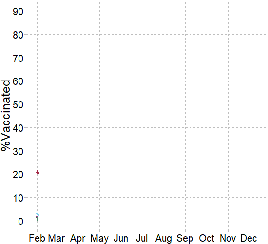
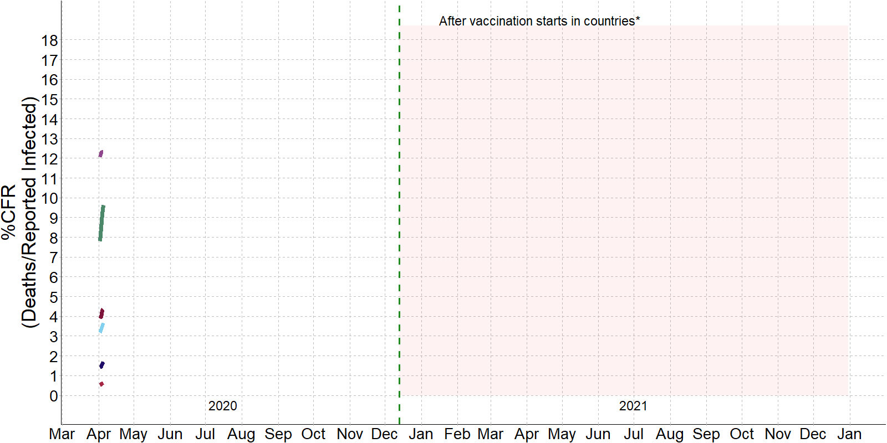
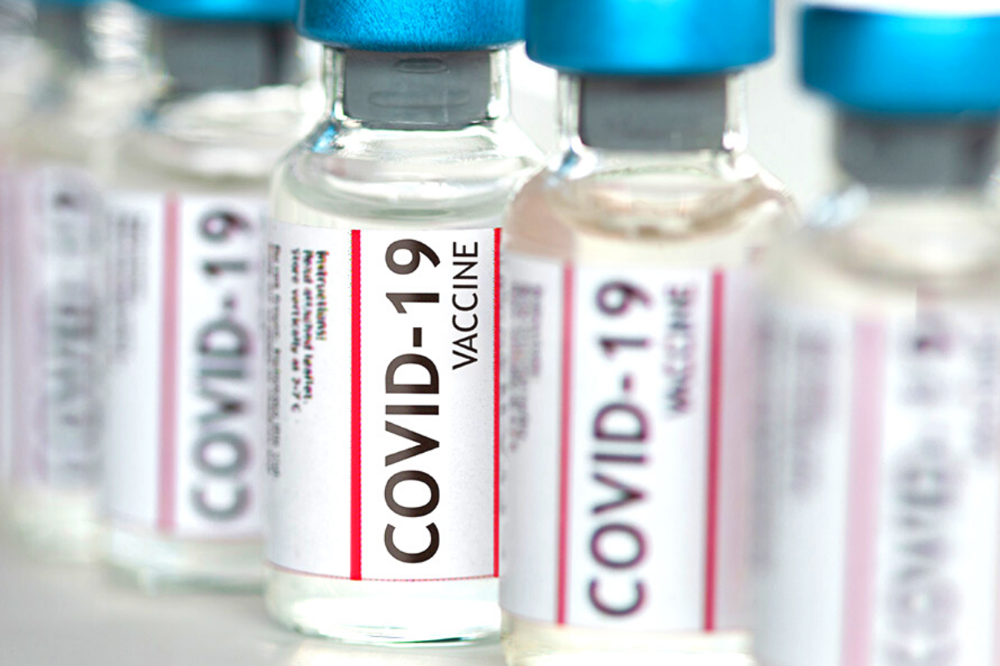
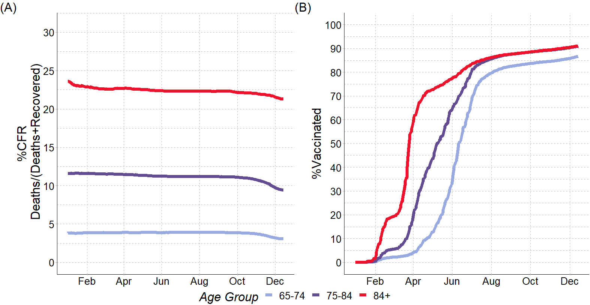
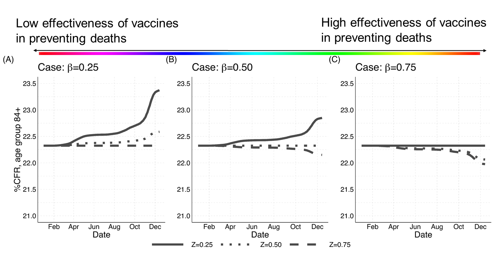
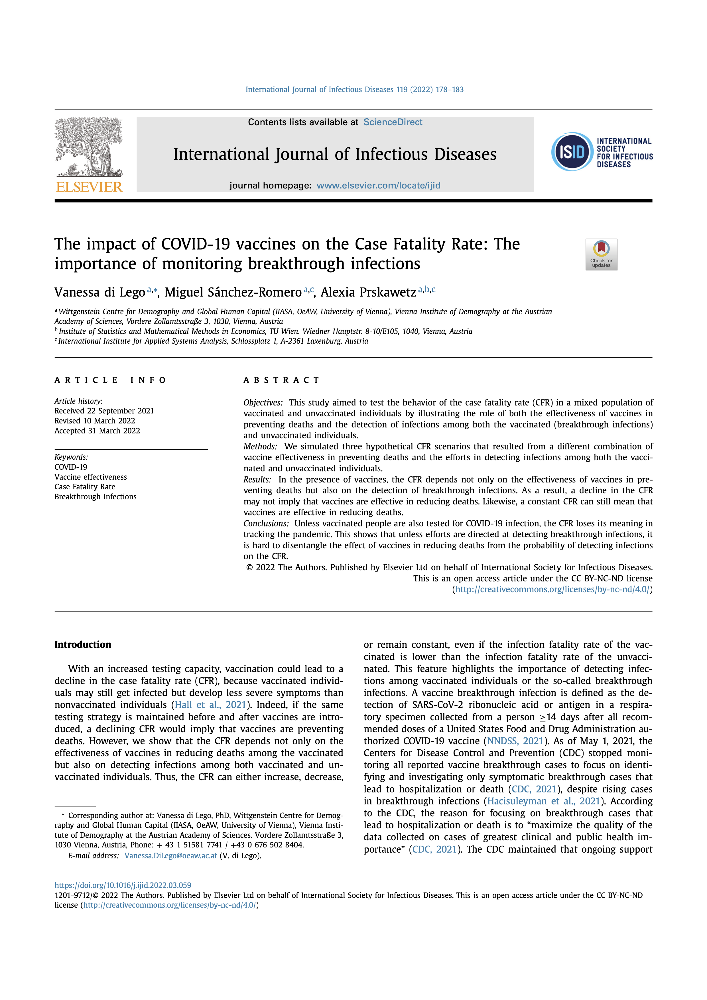

```{r setup, include=FALSE}
options(htmltools.preserve.raw = FALSE)
library(knitr)
```


class: middle
      
Fig. 1 Case Fatality Rate (CFR) and %Fully Vaccinated Trajectories
      
  <div class="container">
   
          
  </div>
        
.remark-slide-content3[Source: Our World in Data (Mathieu et al. 2021)] 


---

class: center, middle

```{r figvax, echo=F, fig.align='right', warning=FALSE, out.width="50%"}
# knitr::include_graphics(here::here("img", "vaccine.png"))
# 
```

# What is driving this pattern in the CFR?
 ## Are vaccines not being effective in reducing deaths?


---

class:remark-slide-content

## The CFR is particularly sensitive to <sup>1</sup>:

.pull-left-2[.content-box-blue[

 $$\text{CFR}_{t,a}=\frac{\text{Deaths}_{t,a}}{\text{Reported Cases}_{t,a}}$$


 
#### .red[Any] factor that impacts the number of .red[confirmed deaths] from a disease and the number of .red[reported cases] in a given time ###
 
]]

.pull-right-1[

- demographic factors


- delays in reported cases


- testing policies

]

--


.pull-left-2[.footnote[[1] (Dowd et al. 2020; Rajgor et al. 2020; Goldstein and Lee 2020; Green et al. 2020; Harman et al. 2021; Smith 2021; Luo et al. 2021; Undurraga et al. 2021)] ]

---
class: 

Fig. 2 Panel (A) %Case-Fatality Rate (CFR); Panel (B) Share of fully vaccinated persons (%). Austria, by age, from Jan to Dec 2021

```{r fig2, echo=F, fig.align='center', warning=FALSE, out.width="95%"}

```
.remark-slide-content3[Source: The number of people vaccinated at each group is taken from BMSGPK, Österreichisches COVID-19 Open Data Informationsportal (2021)]

---

class: middle, center, remark-slide-content

.content-box-blue[
$$\text{CFR}_{t,a}=\frac{\mathcal{D}^{U}_{t,a}+\mathcal{D}^{V}_{t,a}}{d^{U}_{t,a}\mathcal{I}^{U}_{t,a}+\color{red}{d^{V}_{t,a}\mathcal{I}^{V}_{t,a}}}=\text{CFR}^{U}_{t,a}(1-\color{red}{\gamma_{t,a}})+\text{CFR}^{V}_{t,a}\color{red}{\gamma_{t,a}}$$
]


--

$\text{CFR}_{t,a}$ being the weighted sum of $\text{CFR}^{U}_{t,a}$ and $\text{CFR}^{V}_{t,a}$ with weights $\color{red}{\gamma_{t,a}}$: 


.pull-left-1[.content-box-red[
$$\gamma_{t,a}= \frac{\color{red}{d^{V}_{t,a}\mathcal{I}^{V}_{t,a}}}{{d^{U}_{t,a}\mathcal{I}^{U}_{t,a}+\color{red}{d^{V}_{t,a}\mathcal{I}^{V}_{t,a}}}}$$]]

--

.pull-right-2[ 
the ratio between the total number of COVID vaccine .red[breakthroughs] and the total number of COVID-associated ever infected and detected cases] 


---

class: inverse, center, middle, remark-slide-content

.content-box-blue[
$$\text{CFR}_{t,a}=\text{CFR}^{U}_{t,a}(1-\color{red}{\gamma_{t,a}})+\text{CFR}^{V}_{t,a}\color{red}{\gamma_{t,a}}$$]

--

.pull-left-1[.content-box-red[
$$\gamma_{t,a}= 0$$ ]]


.pull-right-1[
No .red[breakthrough] cases: $\text{CFR}_{t,a} = \text{CFR}^{U}_{t,a}$]

--


.pull-left-1[.content-box-red[
$$\gamma_{t,a}\neq 0$$ ]]


.pull-right-1[
How does  $\text{CFR}^{V}_{t,a}\gamma_{t,a}$ affect the $\text{CFR}_{t,a}$?]

---


.pull-left-2[.content-box-blue[
$$\text{CFR}^{V}_{t,a}=\text{CFR}^{U}_{t,a}\frac{(1-\color{red}{\beta_{a}})}{\color{red}{Z_{t,a}}}$$]]

--

.pull-right-1[ $\beta_{a}$ = effectiveness of vaccines in preventing deaths

$Z_{t,a}$ = ratio of detection rates between the vaccinated and the unvaccinated

if $Z_{t,a}=1$, the rate of detection among vaccinated and unvaccinated is the same]

--

.pull-left-2[.content-box-red[
$$(1 − \beta_{a} ) = Z_{t,a}$$
the CFR will remain
**unchanged**, regardless the fact that the case fatality rate of the vaccinated is
**lower** than the case fatality rate of the unvaccinated. ]]

<!-- -- -->

<!-- .pull-left-2[.content-box-purple[the **lower** $\beta_{a}$, the **higher** $Z_{t,a}$ to keep CFR **constant**. the **higher** $\beta_{a}$, the **lower** $Z_{t,a}$ to keep CFR constant -->
<!--  ]] -->

.footnote[[2] Sánchez-Romero et al. 2021] 


---

.remark-slide-content2[Figure 3. Evolution of the %CFR for the age group 84+ in Austria (Jan-Dec 2021) by three different parameter values of]   $\beta_{(84+)}$ .remark-slide-content2[and] $Z_{(t,84+)}$

```{r fig3, echo=F, fig.align='center', warning=FALSE, out.width="85%"}

```
.remark-slide-content3[Source: Simulated CFR values are calculated using data from (Richter et al. 2020b, a)and BMSGPK, COVID-19 Open Data Informationsportal (2021)]

---
class: middle

# Conclusions

<!-- - CFR decline may **not** imply that vaccines are being effective in reducing deaths -->


- A constant CFR can **still** mean that vaccines are effective in reducing deaths


- Detecting infections among both the vaccinated and unvaccinated population is key 

--

### Take-away: unless vaccinated people are **also** tested, it is hard to use the CFR as an indicator for monitoring the pandemic


---
class: last, middle

## Thank you for your attention!

.pull-left-2[
di Lego, V., Sánchez-Romero, M., Prskawetz, A. (2022). The impact of COVID-19 vaccines on the Case Fatality Rate: The importance of monitoring breakthrough infections. *International Journal of Infectious Diseases*, 119, pp. 178–183]

.pull-right-1[
```{r figArt, echo=F, fig.align='center', warning=FALSE, out.width="75%"}

```
]

